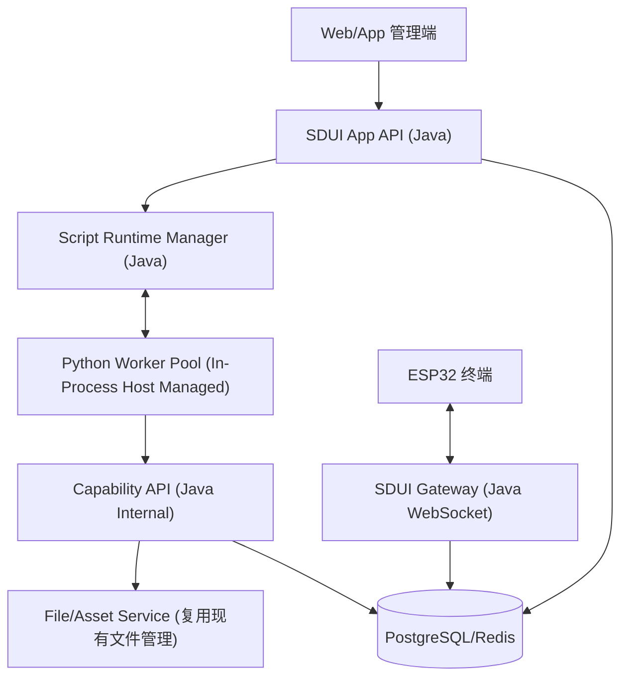

# SDUI MVP 实施方案（AI 生成 + Python 内嵌 Worker Runtime + Java 主控）

## 1. 文档目标

本文档用于将 SDUI 能力以 MVP 形态落地，覆盖：

- 用户自然语言描述 -> AI 生成 SDUI 应用
- 后端托管脚本运行与生命周期管理
- 规范化 `ui/layout` + `ui/update` 下发
- 设备基础管理与基础控制（亮度、音量、重启）
- 资源管理复用现有文件能力（图片封面 + 短音频）

该方案聚焦“先上线可用闭环”，暂不引入 OTA、复杂监控告警、复杂安全体系、多租户强隔离与高阶脚本沙箱。

---

## 2. MVP 核心结论（本轮讨论确认）

1. 必须支持规范下发和更新，避免频繁全量布局影响终端性能。
2. 生成入口在后端，终端仅作为渲染与事件上报执行体。
3. 复用现有文件管理能力作为资源存储基础。
4. 设备基础管理与控制能力在 MVP 即落地。
5. 运行时采用 `Java 主控 + Python 内嵌 Worker 进程池`（同机托管），不采用 JVM 内嵌 Python 解释器作为 MVP 路线。
6. AI 生成物不是任意脚本，而是固定接口约束的 Python 应用模板。
7. AI 生成时必须产出模板名称与简要描述，用于后续模板管理、检索与复用。

---

## 3. 总体架构（MVP）



### 3.1 角色边界

- Java 负责：连接管理、协议编排、状态管理、资源管理、权限审计、脚本生命周期、失败回退、Worker 托管。
- Python 负责：执行 AI 生成的业务脚本（`on_start/on_event/on_timer`），返回布局或增量更新建议。
- 终端负责：渲染 UI 与上报事件，不直接生成和托管业务逻辑。

---

## 4. AI 生成物定义（必须收敛）

## 4.1 AI 生成目标

AI 输出一个“受限 Python SDUI App”：

- 必须包含函数：
  - `on_start(ctx) -> dict`
  - `on_event(ctx, event) -> dict | None`
  - `on_timer(ctx, now_ms) -> dict | None`（可选实现）
- 返回值是标准动作对象，不允许直接操作网络、文件系统、数据库。
- 同时生成应用元信息：`template_name`、`template_description`、`scene_tags`。

## 4.1.1 AI 生成结果对象（应用元信息 + 脚本）

```json
{
  "template_name": "音乐播放器卡片",
  "template_description": "支持封面展示、播放状态与音量调节的轻量播放器界面",
  "scene_tags": ["music", "player", "control"],
  "script_content": "..."
}
```

- `template_name`：必填，1-40 字符，禁止重复（同 `space_id` 内）。
- `template_description`：必填，10-200 字符，描述业务用途。
- `scene_tags`：可选，最多 5 个，用于后台筛选和推荐。

## 4.2 返回动作协议（脚本 -> Java）

```json
{
  "action": "layout|update|noop",
  "page_id": "home",
  "revision_hint": 12,
  "payload": {}
}
```

- `layout`: `payload` 为完整布局对象（用于首屏或大切换）。
- `update`: `payload` 为 `ops[]` 或 patch 对象（用于增量更新）。
- `noop`: 不需要下发。

## 4.3 代码模板策略

AI 不直接自由生成任意脚本，必须基于平台模板生成（Prompt 内给模板与约束）：

- 禁止 `import os/socket/subprocess/pathlib` 等高风险模块。
- 禁止网络请求和文件写入。
- 只能调用平台注入的 `cap` 能力对象（见第 8 节）。

---

## 5. Script Runtime Manager 设计

## 5.1 组件职责

新增 `ScriptRuntimeManager`（Java）：

1. Worker 池管理：启动、心跳、重启、摘除
2. 应用实例管理：加载脚本、绑定设备、停用、回滚
3. 调度执行：将事件转发到 Python Worker，处理超时与重试
4. 结果校验：校验脚本返回动作是否合法
5. 失败回退：脚本异常时触发降级策略（兜底 UI）

## 5.2 Worker 启动策略（内嵌进程池）

- 服务启动后由 Java 进程预热 `N` 个 Python Worker 子进程（建议 `N=2` 起步）。
- 每个 Worker 通过 `stdin/stdout` 与 Java 通信（JSON-RPC）。
- 维护 Worker 状态：
  - `INIT`
  - `READY`
  - `BUSY`
  - `UNHEALTHY`
  - `DEAD`

## 5.3 运行时超时与重试

- 事件执行超时：默认 `800ms`
- 超时重试：最多 `1` 次（切换备用 Worker）
- 连续失败阈值：同一 app/device 连续 `3` 次失败 -> 熔断并降级

---

## 6. Java <-> Python 通信协议（JSON-RPC）

## 6.1 请求

```json
{
  "request_id": "uuid",
  "app_id": "music_player_v1",
  "app_version": 3,
  "device_id": "A1B2C3D4E5F6",
  "method": "on_start|on_event|on_timer",
  "ctx": {},
  "payload": {}
}
```

## 6.2 响应

```json
{
  "request_id": "uuid",
  "ok": true,
  "result": {
    "action": "update",
    "page_id": "player",
    "revision_hint": 22,
    "payload": {
      "transaction": true,
      "ops": []
    }
  },
  "error": null
}
```

## 6.3 错误码建议

- `SCRIPT_SYNTAX_ERROR`
- `SCRIPT_RUNTIME_ERROR`
- `METHOD_NOT_FOUND`
- `TIMEOUT`
- `CAPABILITY_DENIED`
- `INVALID_RESULT`

---

## 7. SDUI 下发策略（性能优先）

## 7.1 下发原则

1. 首屏/结构切换：`ui/layout`
2. 小改动和高频交互：`ui/update`
3. 任何 update 必须带 `page_id + revision + transaction`

## 7.2 Revision 管理

- 每个 `device_id + page_id` 维护单调递增 revision。
- 即使脚本返回 `revision_hint`，最终 revision 由 Java 分配。
- 若检测状态漂移或终端拒收，回退一次全量 `ui/layout`。

## 7.3 终端性能保护

- 限流：每设备每秒 update 条数上限（例如 10）
- 合并：100ms 窗口合并多条 ops
- 降级：高频期间只保留最后一次状态

---

## 8. Capability API（脚本可调用能力）

脚本不直接访问底层资源，统一通过 Java 提供能力：

## 8.1 MVP 开放能力

- `cap.asset.get(asset_id)`
- `cap.asset.search(tags, limit)`
- `cap.device.get_state(device_id)`
- `cap.device.control(device_id, command, params)`（受控）
- `cap.store.get(key)` / `cap.store.set(key, value)`（会话状态）

## 8.2 能力调用约束

- 每次事件最多调用能力次数：建议 5 次
- 超时：单次能力调用 200ms
- 调用审计：记录 app_id、device_id、method、耗时、结果

---

## 9. 资源管理方案（复用现有文件管理）

## 9.1 复用策略

- 复用现有上传、存储、访问链路
- 新增 SDUI 资源元数据层（不破坏原文件域模型）
- 资源预处理在 MVP 采用同步处理（上传后立即可用），后续再演进为异步任务化。

## 9.2 新增表（建议）

### `sdui_asset`

- `id` (PK)
- `file_id` (关联现有文件表)
- `asset_type` (`IMAGE_COVER` / `AUDIO_CLIP`)
- `name`
- `tags` (jsonb)
- `mime_type`
- `size_bytes`
- `duration_ms`（音频）
- `width` / `height`（图片）
- `processed_status` (`PENDING` / `READY` / `FAILED`)
- `processed_payload`（可存缩略图/编码结果索引）
- `space_id`
- `created_at` / `updated_at`

### `sdui_asset_binding`

- `id` (PK)
- `app_id`
- `asset_id`
- `usage_type` (`cover` / `icon` / `sound`)
- `created_at`

---

## 10. 设备管理与基础控制（MVP 必做）

## 10.1 设备主表（建议）

### `sdui_device`

- `device_id` (PK)
- `name`
- `status` (`ONLINE` / `OFFLINE`)
- `last_seen_at`
- `current_app_id`
- `current_page_id`
- `space_id`
- `created_at` / `updated_at`

## 10.2 设备心跳快照

### `sdui_device_telemetry`

- `id` (PK)
- `device_id`
- `wifi_rssi`
- `temperature`
- `free_heap_internal`
- `free_heap_total`
- `uptime_s`
- `created_at`

## 10.3 控制指令记录

### `sdui_device_command`

- `id` (PK)
- `device_id`
- `topic` (`cmd/control`)
- `payload` (jsonb)
- `cmd_id`（请求-回执关联键）
- `action`
- `requested_value`
- `applied_value`
- `reason`
- `ack_ts`
- `status` (`SENT` / `ACKED` / `REJECTED` / `ERROR` / `TIMEOUT` / `FAILED`)
- `created_at` / `acked_at`

---

## 11. 应用与发布模型

## 11.1 应用定义

### `sdui_app`

- `id` (PK)
- `name`
- `description`
- `scene_tags` (jsonb)
- `status` (`DRAFT` / `PUBLISHED` / `DISABLED`)
- `entry_mode` (`PYTHON_SCRIPT`)
- `space_id`
- `created_by`
- `created_at` / `updated_at`

### `sdui_app_version`

- `id` (PK)
- `app_id`
- `version_no`
- `script_content`
- `llm_prompt_snapshot`
- `validation_report`
- `published` (bool)
- `created_at`

### `sdui_device_app_binding`

- `id` (PK)
- `device_id`
- `app_id`
- `app_version_id`
- `active` (bool)
- `bound_at`

---

## 12. API 设计（MVP）

## 12.1 应用生成

- `POST /api/v1/sdui/apps/generate`
  - 输入：自然语言需求 + 可选资源标签 + 可选目标设备
  - 输出：`app_id + draft_version + template_name + template_description + 预览layout`

- `POST /api/v1/sdui/apps/{appId}/revise`
  - 输入：修改指令（自然语言）
  - 输出：新版本草稿 + diff 摘要

## 12.2 发布与绑定

- `POST /api/v1/sdui/apps/{appId}/publish`
  - 输入：`version_id`, `device_ids[]`
  - 行为：激活绑定，触发 `on_start`，下发首屏

## 12.3 设备控制

- `POST /api/v1/sdui/devices/{deviceId}/control`
  - 输入：`command=volume|brightness|reboot`, `value`

## 12.4 资源管理

- `POST /api/v1/sdui/assets` 上传并注册为 SDUI 资源
- `GET /api/v1/sdui/assets` 查询资源列表
- `POST /api/v1/sdui/apps/{appId}/assets:bind` 绑定资源

## 12.5 运行时观察

- `GET /api/v1/sdui/runtime/workers`
- `GET /api/v1/sdui/runtime/apps/{appId}/metrics`
- `GET /api/v1/sdui/devices/{deviceId}/timeline`

---

## 13. 核心时序

## 13.1 生成与发布

1. 管理端提交需求
2. Java 调 LLM 生成 `模板元信息 + 脚本`（模板约束）
3. 脚本静态校验（语法、禁用模块、接口完整性）
4. 保存 `sdui_app`（名称/描述/标签）与 `sdui_app_version` 草稿
5. 发布绑定设备
6. Runtime 调用 `on_start`
7. Java 校验返回并下发 `ui/layout`

## 13.2 交互更新

1. 终端上报 `ui/click`
2. 网关路由到绑定 app
3. Runtime 调用 `on_event`
4. 返回 `update/layout/noop`
5. Java 做 revision 分配和协议封装
6. 优先下发 `ui/update`
7. 异常时回退 `ui/layout`

---

## 14. 校验与安全（MVP 最小集）

## 14.1 脚本校验

- AST 静态检查（禁用 import）
- 必要函数完整性检查
- 返回对象结构校验

## 14.2 运行限制

- 单次执行超时（800ms）
- Worker 内存上限（例如 256MB）
- Worker 非 root 账户运行

## 14.3 安全边界

- 脚本无数据库凭据
- 脚本无文件系统写权限
- 脚本无外网访问权限（默认）

---

## 15. 异常与回退

1. **脚本语法错误**：阻止发布，返回可读诊断。
2. **运行时异常**：记录错误，返回兜底 update 或保持当前界面。
3. **超时**：中断请求，单次重试，失败则回退兜底界面。
4. **Worker 崩溃**：自动重启并重建实例状态。
5. **下发失败（设备离线）**：直接丢弃本次消息并记录日志/指标，不做离线队列与自动补发。
6. **控制命令超时**：`SENT` 状态超过超时阈值自动转为 `TIMEOUT`。

---

## 16. 观测指标（MVP 必备）

- `script_exec_latency_ms`（P50/P95/P99）
- `script_exec_error_rate`
- `worker_alive_count`
- `sdui_update_per_device_qps`
- `layout_fallback_count`
- `device_online_count`
- `command_ack_rate`

---

## 17. 开发里程碑（建议 4 个 Sprint）

## Sprint 1：运行底座（1-2 周）

- ScriptRuntimeManager
- Python Worker 池 + JSON-RPC
- 脚本加载/执行/超时/重启

## Sprint 2：应用生成发布闭环（1-2 周）

- 生成 API / revise API
- 脚本校验链路
- app/version/binding 数据模型

## Sprint 3：设备与协议闭环（1 周）

- `ui/layout + ui/update` 规范下发
- revision/transaction 管理
- 设备控制与命令回执

## Sprint 4：资源与稳定性（1 周）

- 复用文件管理接入 `sdui_asset`
- 封面图/短音频绑定能力
- 运行指标与兜底策略完善

---

## 18. 本方案刻意不做（MVP 外）

- OTA 升级
- 全量监控告警平台（Grafana/规则引擎）
- 复杂多租户计费配额
- 任意语言脚本引擎并存
- 复杂前端可视化编排器

---

## 19. 已确认决策（进入开发前已锁定）

1. Python Worker：采用单机内嵌进程池（Java 托管子进程）。
2. 设备离线：消息直接丢弃并记录，不引入离线队列。
3. `ui/update`：协议层兼容 `ops[]` 与 direct patch，两者都支持；运行时生成策略优先输出 `ops[]`（更利于性能与一致性）。
4. 资源预处理：MVP 走同步处理，保证上传后可立即绑定使用。
5. AI 生成结果：必须包含模板名称和描述，写入模板管理域用于复用。
6. 首批示范应用建议：计数器、音乐控制面板、语音卡片。

---

## 20. 结语

该 MVP 路线的关键不是“功能最多”，而是“边界清晰、可控运行、可稳定迭代”。

通过 `Java 主控 + Python Sidecar + 受限脚本模板 + 规范 update 下发`，可以在不牺牲未来演进空间的前提下，最快实现从“用户描述”到“终端可交互 SDUI 应用”的真实闭环。
