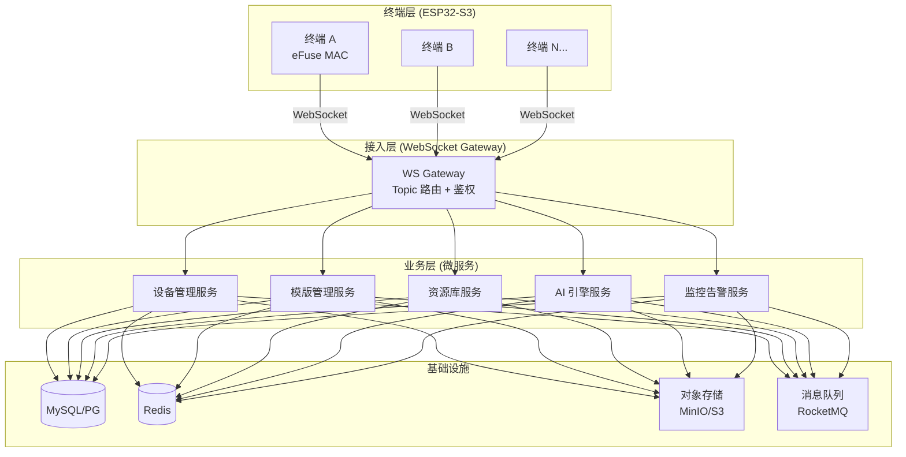
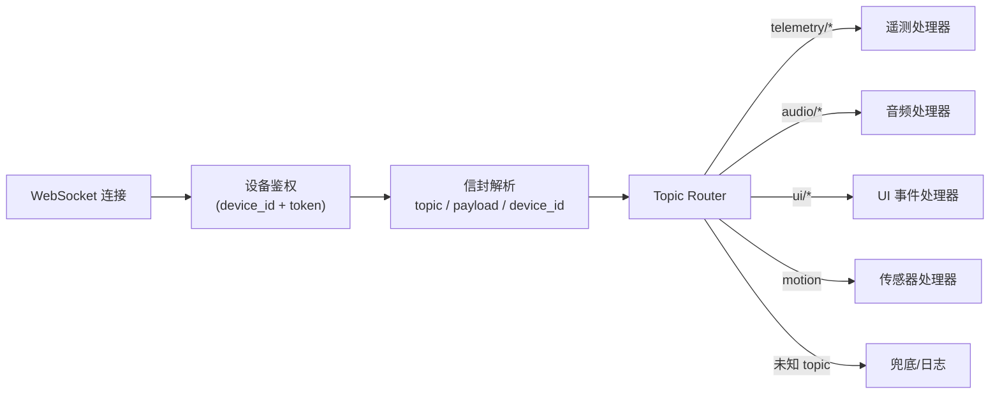
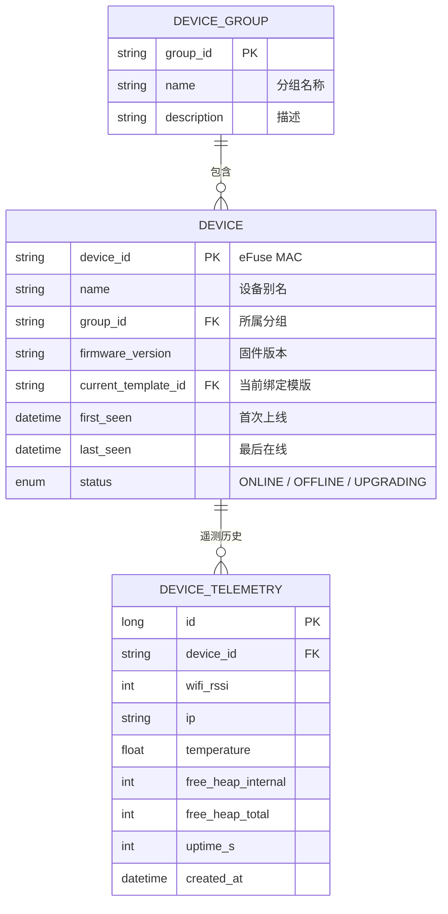
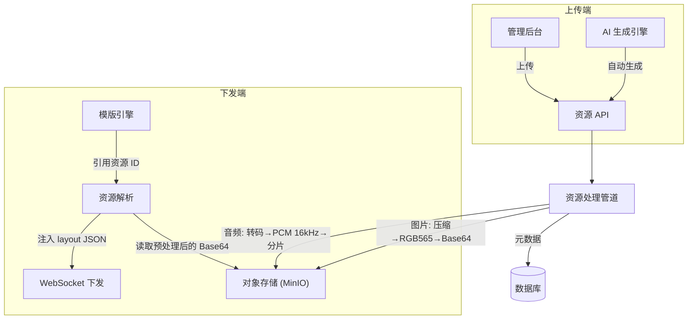
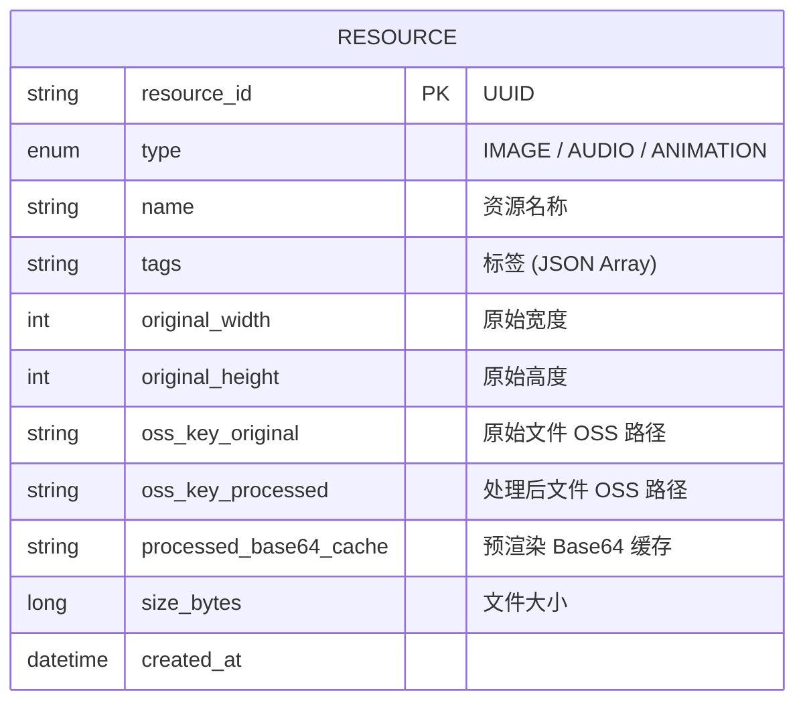
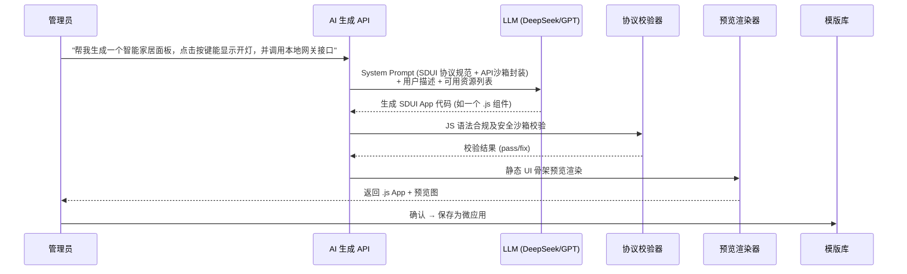
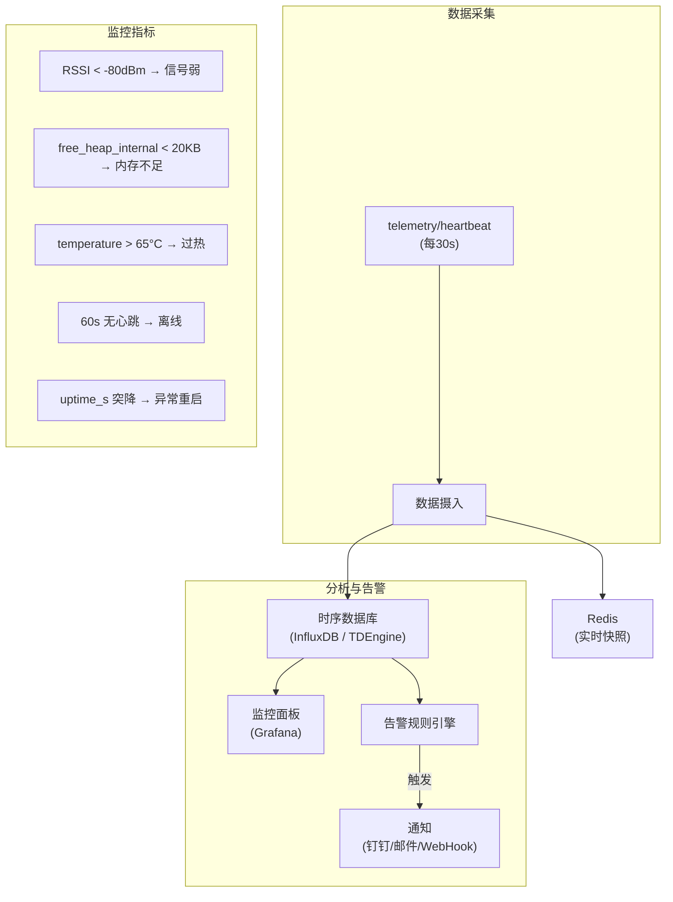
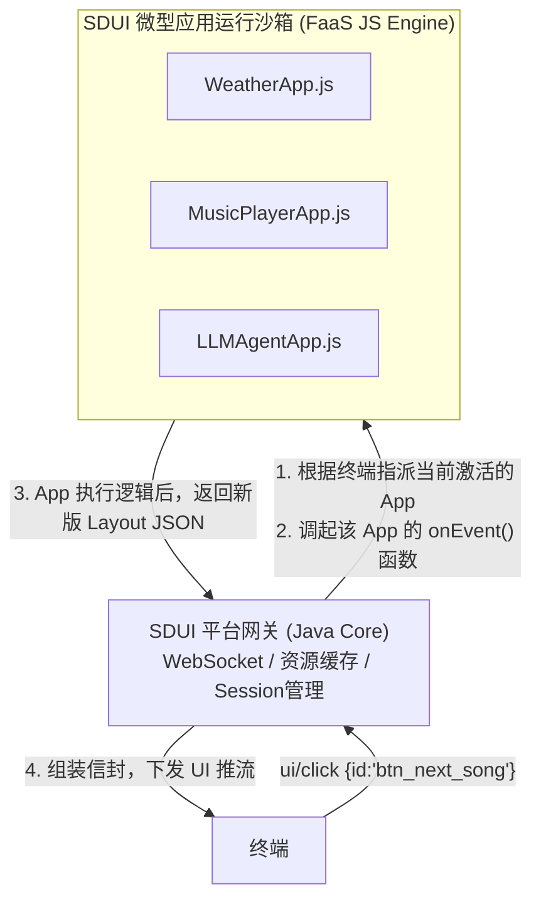
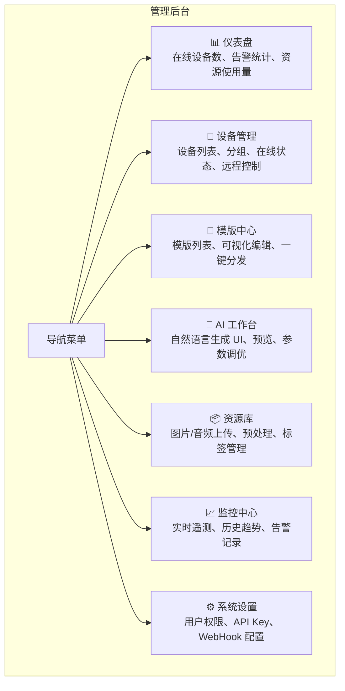
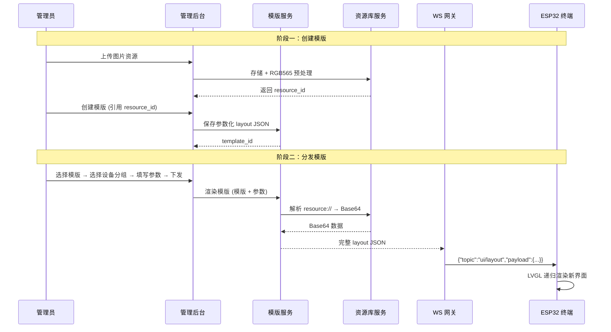

# SDUI Java 后端平台 — 架构设计方案

基于现有 ESP32-S3 终端 SDUI 协议（Topic-Payload JSON + WebSocket 全双工），规划一个面向**生产环境**的 Java 后端服务平台。本方案聚焦架构分层、核心领域模型与能力扩展蓝图，不涉及代码细节。

---

## 一、总体架构分层



### 分层职责

| 层 | 职责 | 关键技术 |
|---|------|---------|
| **接入层** | WebSocket 长连接管理、JSON 信封解析、Topic 路由分发、设备鉴权 | Spring WebFlux + Netty |
| **业务层** | 各领域微服务，按业务边界独立部署 | Spring Boot 3.x |
| **基础设施** | 持久化、缓存、文件存储、异步解耦 | MySQL, Redis, MinIO, MQ |

---

## 二、核心模块详细设计

### 2.1 WebSocket 接入网关

> 替代当前 [server.py](file:///d:/esp-idf/src/sdui/server.py) 的 [sdui_handler](file:///d:/esp-idf/src/sdui/server.py#391-465) 单函数路由。



**设计要点：**

- **设备鉴权**：终端首次连接时，网关从首条 `telemetry/heartbeat` 的 `device_id` 提取 MAC 地址，与设备注册表比对。可扩展为基于 Token 的安全握手。
- **Topic 路由**：策略模式注册，Handler 按需加载，新增业务 topic 零侵入。
- **会话绑定**：每个 WebSocket 连接绑定一个 `DeviceSession`，存储于 Redis，支持网关多实例无状态横向扩展。
- **下行推送封装**：统一封装 `sendTopic()`、`sendLayout()`、`sendUpdate()` 工具方法，与终端协议保持一致。

---

### 2.2 设备管理服务

> 替代当前内存中的 `devices: dict`，实现持久化的终端全生命周期管理。



**核心能力：**

| 能力 | 说明 |
|------|------|
| **设备注册与发现** | 终端首次心跳自动注册，管理端手动确认/分组 |
| **状态追踪** | 基于 Redis TTL 的在线检测（心跳 30s，60s 无心跳标记 OFFLINE） |
| **分组管理** | 设备按场景/位置分组（如"门店A"、"展厅3F"），支持批量操作 |
| **远程控制** | 通过 `cmd/control` topic 批量下发亮度/音量/重启指令 |
| **OTA 升级** | 管理固件版本，按分组灰度推送升级（新增 `cmd/ota` topic） |

---

### 2.3 资源库服务（Resource Library）

> 管理服务端向终端下发的媒体资源（图片、音频片段），解决当前 Base64 内嵌的低效问题。



**数据模型：**



**核心能力：**

| 能力 | 说明 |
|------|------|
| **图片预处理管道** | 上传时自动按终端分辨率（466×466 圆屏）裁剪、压缩、转 RGB565 并生成 Base64 缓存。下发时直接读取缓存，无需实时编码 |
| **音频预处理管道** | 上传的 MP3/WAV 自动转码为 `PCM 16kHz 16bit Mono`，分片存储，下发时逐片通过 `audio/play` 推流 |
| **标签 + 搜索** | 资源按标签分类（如 `icon`、`background`、`notification-sound`），支持模板引用时快速检索 |
| **引用追踪** | 记录每个资源被哪些模版引用，防止误删 |
| **标签 + 搜索** | 资源按标签分类（如 `icon`、`background`、`notification-sound`），支持应用引用时快速检索 |
| **引用追踪** | 记录每个资源被哪些应用引用，防止误删 |
| **CDN 加速（可选）** | 大尺寸资源可走 HTTP 下载通道（终端新增 HTTP 下载能力后），避免 WebSocket 阻塞 |

---

### 2.4 AI UI 生成引擎

> 核心高级功能：通过自然语言描述，AI 自动生成**包含前端 UI 和后端逻辑的一站式 SDUI App**。



**设计要点：**

| 要点 | 方案 |
|------|------|
| **System Prompt 工程** | 将 README 中的完整 SDUI 协议（组件类型、属性、Action URI、动画等）作为 System Prompt 注入 LLM，确保生成的 JSON 严格合规 |
| **协议校验器** | LLM 生成的 JSON 经过结构校验：字段类型检查、枚举值校验（flex/align/anim.type 等）、嵌套层级限制、资源引用有效性检查 |
| **约束注入** | 自动注入终端硬件约束：圆屏 466×466、安全边距 40px、粒子特效 ≤30 个、图片尺寸 ≤200×200 等 |
| **迭代优化** | 用户可对生成结果进行自然语言修改（"把按钮颜色改成蓝色"、"加一个进度条"），LLM 在前次结果基础上增量修改 |
| **资源自动绑定** | LLM 可从资源库中检索匹配的图片/图标，自动插入 `resource://` 引用 |

**AI 生成的三种使用场景：**

1. **管理后台生成** — 管理员在 Web 端输入描述，AI 生成业务应用脚本，预览后保存。
2. **终端实时生成 (Agent式)** — 用户说“帮我做一个番茄钟面板”，从 STT 到 LLM 生成到最终下发运行，全自动完成。
3. **批量场景生成** — 输入业务需求，AI 一键生成该业务涉及的多个界面的全套微应用。

---

### 2.6 监控与告警服务

> 基于终端每 30s 上报的 `telemetry/heartbeat` 数据，构建设备运行态感知体系。



**告警规则表：**

| 指标 | 告警条件 | 级别 | 动作 |
|------|---------|------|------|
| `wifi_rssi` | < -80 dBm 持续 3 个周期 | WARNING | 通知运维 |
| `free_heap_internal` | < 20,000 字节 | CRITICAL | 通知 + 自动重启指令 |
| `temperature` | > 65°C | CRITICAL | 通知 + 降低亮度 |
| 心跳中断 | 60s 无 heartbeat | ERROR | 标记离线 + 通知 |
| `uptime_s` 突降 | 比上次小（说明重启了） | INFO | 记录重启事件 |
| `free_heap_total` | 持续下降趋势 (5 分钟窗口) | WARNING | 疑似内存泄漏告警 |

---

## 三、高内聚扩展架构：SDUI App Bundle (微应用包)

> **这是一个极具洞见的设计理念**：将 UI 定义（布局 JSON）和业务逻辑（事件处理）强行剥离会带来巨大的维护灾难（类似早年 HTML 与 JS 的分离）。目前最先进的前端框架（React/Vue/Svelte）都采用了**「高内聚组件化」**的单文件模式，SDUI 平台也理应如此。

我们将这种高内聚的运行单元称为 **SDUI App Bundle（微应用脚本包）**。

### 3.1 核心理念：模版即应用

平台不再单独管理“纯数据的 Layout JSON 模版”，而是管理一个个完整的**「沙箱脚本应用（比如 JavaScript / TypeScript 脚本）」**。在这个脚本里，既声明了应该给终端画什么样的全量 UI (Layout)，又声明了当收到了来自这套 UI 里的某个按键点击时，该执行什么后端逻辑 (onEvent)。

**这带来了两个绝佳优势：**
1. **人类极度易维护**：一个业务一个文件，UI 长什么样和点了按钮去调什么接口，一览无余，不存在“去找这个模版绑了那个后端函数”的对齐难题。
2. **AI 极度容易生成**：大模型最擅长的就是编写独立、自包含的代码块。告诉它“按我给的 JS 框架格式，写一个带三个按钮并且各自附有不同逻辑处理代码的天气应用”，它能一次性给你生成完全不需要联调的完美代码。

### 3.2 架构实现：双引擎沙箱

在这个模式下，Java 基础平台只需提供安全隔离的运行时环境（推荐 `GraalVM JavaScript Engine` 或 `Rhino`）：



### 3.3 示例：一个极其优雅的 SDUI APP 单文件

来看一个 AI 能够 1 秒钟写完，同时极其便于开发者理解的「**计数器微应用 (CounterApp.js)**」：

```javascript
/**
 * APP 名称: 极简计数器
 * 版本: 1.0.0
 */

// 全局/会话状态 (由 Java 沙箱在应用激活时注入持久化存储对象)
let count = sessionState.get("count") || 0;

// ==========================================
// 1. UI 渲染编排 (Layout Builder)
// 永远返回当前状态下，该应用期望向终端展现的绝对布局。
// ==========================================
function renderLayout() {
    return {
        "flex": "column", 
        "justify": "center", 
        "align_items": "center", 
        "gap": 20,
        "children": [
            {
                "type": "label", 
                "text": `当前点击次数: ${count}`, 
                "font_size": 26, 
                "text_color": count > 10 ? "#FF0000" : "#FFFFFF"
            },
            {
                "type": "button", 
                "id": "btn_add", 
                "text": "点我 +1",
                "bg_color": "#2ecc71"
            },
            {
                "type": "button", 
                "id": "btn_reset", 
                "text": "重置",
                "bg_color": "#e74c3c"
            }
        ]
    };
}

// ==========================================
// 2. 也是唯一业务逻辑入口 (Event Handler)
// 接收一切该终端发出的事件。
// ==========================================
function onEvent(event_type, payload) {
    if (event_type === "ui/click") {
        if (payload.id === "btn_add") {
            count += 1;
            // 业务复杂逻辑：比如发出了 HTTP 请求调外部接口...
            // httpClient.post("https://...", {count: count});
        } else if (payload.id === "btn_reset") {
            count = 0;
            // platform.playSound("reset_confirm.wav");
        }
    } else if (event_type === "motion") {
        if (payload.type === "shake") {
            count += 5; // 比如摇一摇加 5 
        }
    }
    
    // 状态更新后保存，并请求 Java 宿主重刷画面
    sessionState.set("count", count);
    
    // 返回重新渲染的 Layout，Java 平台会自动推向终端 WebSocket
    return renderLayout(); 
}

// ==========================================
// 3. (可选) 定时任务或生命周期事件
// ==========================================
function onAppStart() {
    // 例如拉取最新缓存，随后主动推送首屏
    // httpClient.get("https://...").then(data => { ... });
    return renderLayout();
}
```

### 3.5 底层能力管控与服务市场 (Capability Management)

您提到的**“对平台能力侧是不是也需要进行管理？”** 极具架构前瞻性。

事实上，当微应用在调用 `sdui.tts.speakStream()` 这样简单的一行代码时，背靠的是极其昂贵的底层算力和网络资源。如果放任不管，一个死循环的微应用就能把整个平台的 DeepSeek 余额耗尽，或把带宽打穿。

因此，Java 核心需要一个强大的**能力控制中枢 (Capability Manager)**，它作为沙箱和底层资源之间的闸门：

```mermaid
flowchart LR
    subgraph 微应用沙箱层
        JS["VoiceAgent.js<br/>调用: sdui.ai.chat()"]
    end
    
    subgraph 能力管控中枢 (Capability Manager)
        AUTH["鉴权与配额"]
        ROUTE["驱动路由 (Driver)"]
        CB["熔断降级 (Circuit Breaker)"]
    end
    
    subgraph 物理服务池
        API1["DeepSeek API"]
        API2["火山引擎 TTS"]
        API3["本地 Whisper"]
    end
    
    JS --> AUTH --> ROUTE --> CB --> 物理服务池
```

**管控中枢的三大核心职责：**

1. **统一抽象与驱动路由（Driver Pattern）**：
   - 微应用的代码里永远只写 `sdui.tts.*`，它不关心用的是谁家（火山、阿里、还是微软 edge-tts）的声音。
   - 管理后台有一个【服务提供商配置】界面，管理员可以随时切换 TTS 的底层实现提供商（比如从微软换成自建服务），而**上层的微应用代码一行都不用改**。
2. **配额与计费隔离（Quota & Billing）**：
   - 基于多租户设计，当 `onEvent(deviceId, ...)` 被触发时，网关知道这台终端背后的归属租户/项目组。
   - `Capability Manager` 会拦截每一次调用，从 Redis 中扣减该租户的 Token 余额或检查 QPS 限制。一旦超储，直接在 Java 层抛出配额耗尽异常，甚至不让请求出网，保护平台资金安全。
3. **熔断与优雅降级（Circuit Breaking）**：
   - 如果云端 DeepSeek API 突然大面积超时，不断涌入的 STT 录音会导致 Java 应用线程池爆满。
   - 此时管控层会自动熔断（比如使用 Resilience4j），迅速向 JS 层抛出异常。
   - JS 捕获异常后，可以选择 `return renderLayout()` 给屏幕画一个 [(✖_✖) AI 接口开了个小差](file:///d:/esp-idf/src/sdui/server.py#272-286)，避免终端长时间白屏死等。

### 3.6 “管理后台+网关”的工作流闭环

在这个高内聚的 Bundle 架构中，“终端-App配置”变成了一种极度轻量级的映射表：

**在控制台中：**
管理员有一个“终端列表”，旁边是“可用 SDUI 应用商店（App Store）”。
管理员点选 `Device_A`，选择 `指派应用 -> CounterApp`。

**在终端与 Java 网关底层交互时：**
1. 网关立刻初始化针对该 `device_id` 的 `CounterApp.js` 实例。调起它的 `renderLayout()`，将初始界面 JSON 推送到屏幕。
2. 用户在真实屏幕上按下“点我+1”。
3. 纯原生事件 `{"topic": "ui/click", "payload": {"id": "btn_add"}}` 上报到了 Java 网关。
4. 网关一查表：“当前这台终端绑定的是 `CounterApp`”。
5. 网关立刻调起 `CounterApp` 实例的 `onEvent("ui/click", {"id": "btn_add"})`。
6. `CounterApp` 的 JS 代码被执行，`count` 变成了 1。函数最后的 `return renderLayout()` 返回了新的 JSON(`当前点击次数: 1`)。
7. Java 网关负责把它打包通过 WebSoket 按 `ui/layout` 主题秒速刷给屏幕。

这就是**基于高内聚 JS 沙箱容器加上完善能力管控库**的极简架构，完美融合您的“像写 React 页面一样把逻辑打包在一起然后一键下发”的宝贵构想。

---

## 四、核心网关管理台（Web Console）

所有服务能力通过统一的管理后台呈现。



---

## 五、数据流全景图

以"管理员创建模版并下发到终端"为例，展示完整数据流：



---

## 六、技术选型汇总

| 领域 | 推荐方案 | 备选 |
|------|---------|------|
| **Web 框架** | Spring Boot 3.x + WebFlux | |
| **WebSocket** | Spring WebSocket (Reactive) + Netty | |
| **关系数据库** | MySQL 8.0 / PostgreSQL 15 | |
| **缓存** | Redis 7.x (Cluster) | |
| **对象存储** | MinIO (自建) | 阿里云 OSS / AWS S3 |
| **时序数据库** | TDEngine / InfluxDB | 也可用 MySQL 分区表简化方案 |
| **消息队列** | RocketMQ | Kafka (如有大数据需求) |
| **LLM** | DeepSeek API (OpenAI 兼容) | |  
| **管理后台前端** | Vue 3 + Element Plus / Ant Design Vue | React + Ant Design |
| **监控面板** | Grafana (对接时序库) | 自研 |
| **容器化** | Docker + Docker Compose | K8s (规模化部署) |

---

## 七、推荐开发路线图

> [!IMPORTANT]
> 建议按阶段迭代开发，每个阶段都可独立交付使用。

### Phase 1：基础平台（2-3 周）
- WebSocket 网关 + Topic 路由框架
- 设备自动注册 + 在线状态管理
- 管理后台骨架（设备列表 + 实时遥测展示）
- 替代现有 Python MVP 的所有基础功能

### Phase 2：模版与资源（2-3 周）
- 资源库服务（图片上传 + RGB565 预处理 + 音频转码管道）
- 模版 CRUD + 参数化渲染引擎
- 模版一键绑定/切换到设备/分组
- 管理后台：模版中心 + 资源库页面

### Phase 3：AI 引擎（1-2 周）
- AI UI 生成（System Prompt 工程 + 协议校验器）
- 管理后台 AI 工作台（对话式 UI 生成 + 预览）
- 生成结果一键保存为模版

### Phase 4：监控告警（1-2 周）
- 遥测数据持久化（时序库）
- 告警规则引擎 + 通知集成
- Grafana 监控面板

### Phase 5：高级能力（持续迭代）
- OTA 固件管理 + 灰度升级
- 终端语音实时生成 UI
- 模版市场 + 生态
- 多租户隔离

---

## 八、与现有终端的兼容性

> [!TIP]
> 本架构设计**完全兼容现有 ESP32-S3 固件**，终端无需任何修改。

Java 后端严格遵循 README 中定义的 SDUI 协议：
- **上行兼容**：`ui/click`、`audio/record`、`motion`、`telemetry/heartbeat` — 信封格式不变
- **下行兼容**：`ui/layout`、`ui/update`、`audio/play`、`cmd/control` — 载荷格式不变
- **Action URI 兼容**：`local://`、`server://`、无前缀 — 路由机制不变

唯一变化是终端配网时填写的 WebSocket Server 地址改为 Java 服务的地址和端口。
